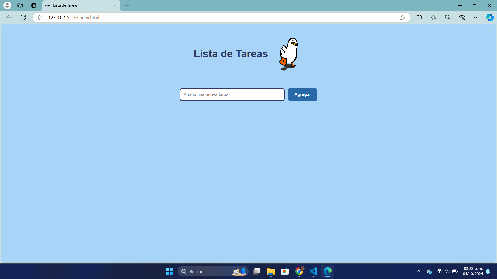
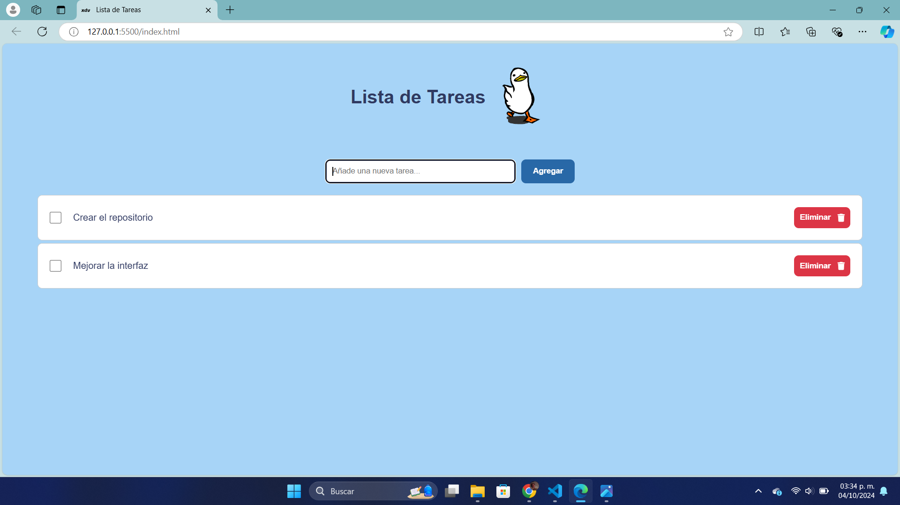
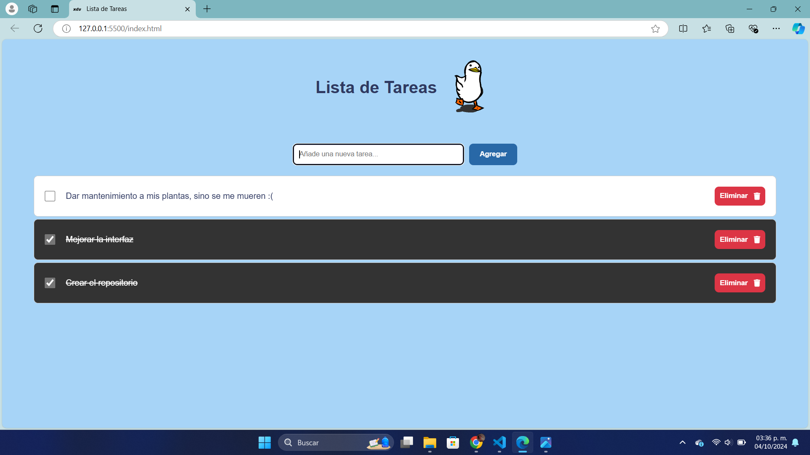

# Lista de Tareas

Esta es una aplicación web simple para gestionar tareas, creada con HTML, CSS y JavaScript. Permite a los usuarios agregar, visualizar, marcar como completadas y eliminar tareas, además es una práctica para comprender la manipulación del DOM, el manejo de eventos y el almacenamiento de datos en el navegador.

---

## Estructura del Proyecto

El repositorio contiene los siguientes archivos:

- `index.html`: La estructura básica de la aplicación.
- `styles.css`: Los estilos CSS para la aplicación.
- `app.js`: La lógica en JavaScript que hace funcionar la lista de tareas.

---

## Funcionalidades

1. **Agregar Tareas**: Puedes añadir nuevas tareas ingresando texto en el campo de entrada y haciendo clic en el botón "Agregar".
2. **Eliminar Tareas**: Cada tarea tiene un botón de "Eliminar" que permite eliminarla de la lista.
3. **Marcar como Completada**: Puedes marcar una tarea como completada haciendo clic en cada tarea (la casilla es solo un adorno). Las tareas completadas se moverán al final de la lista.
4. **Almacenamiento Local**: Las tareas se guardan en el almacenamiento local del navegador, por lo que no se perderán al recargar la página.
5. **Validación de Entrada**: Se evita agregar tareas vacías enviando una alerta de error al usuario.
6. **Responsividad**: La aplicación se ajusta a diferentes tamaños de pantalla.

---

## Capturas de Pantalla de la Aplicación en Funcionamiento

### Pantalla de Inicio


### Validación de Entrada


### Agregar Tareas


### Marcar Tareas como Completadas




### Eliminar Tareas


---

## Cómo Ejecutar la Aplicación

Existen dos formas de ejecutar la aplicación.

**Opción 1: Usar Visual Studio Code y Live Server**

1. **Abre Visual Studio Code**:
   Si no tienes Visual Studio Code instalado, puedes descargarlo e instalarlo desde [aquí](https://code.visualstudio.com/).

2. **Clona este repositorio en tu máquina local**:
   ```bash
   git clone https://github.com/ximenaDiazV/Lista-de-Tareas.git

3. **Abre la carpeta del proyecto**:
   - Haz clic en **File** > **Open Folder...** y selecciona la carpeta donde clonaste el repositorio.

4. **Instala la extensión Live Server**:
   - Dirígete a la pestaña de extensiones (icono de cuadrado en la barra lateral izquierda).
   - Busca **"Live Server"** y haz clic en **"Instalar"**.

5. **Inicia el servidor**:
   - Haz clic derecho en el archivo `index.html` en el explorador de archivos y selecciona **"Open with Live Server"**. Esto abrirá la aplicación en tu navegador predeterminado.


**Opción 2: Abrir el archivo HTML directamente en el navegador**

1. **Clona este repositorio en tu máquina local**:
   ```bash
   git clone https://github.com/ximenaDiazV/Lista-de-Tareas.git

2. **Navega hasta el directorio del proyecto**:
    - Utiliza la terminal o el explorador de archivos para dirigirte a la carpeta donde clonaste el repositorio.

3. **Abre el archivo index.html en tu navegador**:
    - Haz doble clic en el archivo index.html o haz clic derecho y selecciona "Abrir con" y elige tu navegador preferido.